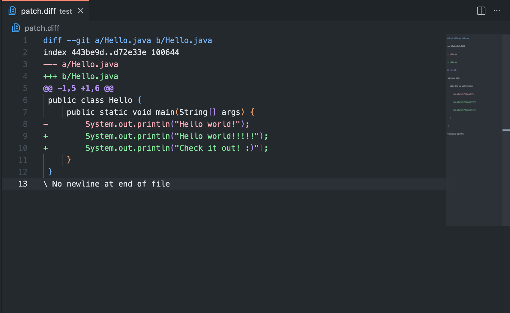
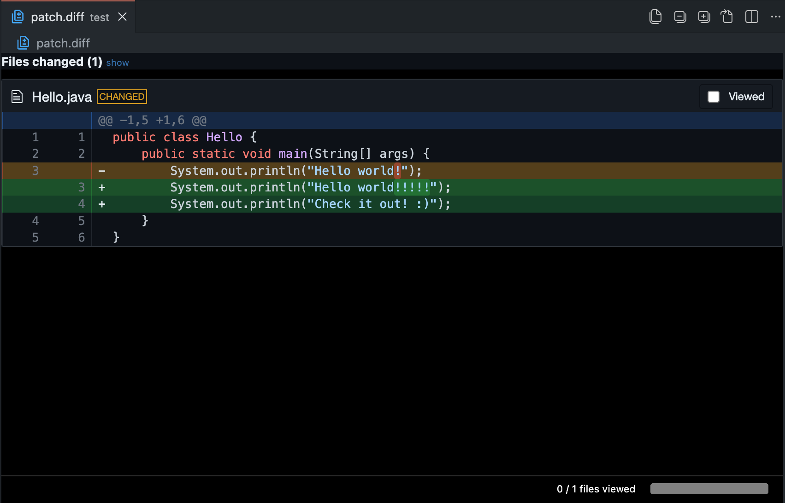

# Diff Viewer extension for VS Code

A simple wrapper for [diff2html](https://github.com/rtfpessoa/diff2html) library to easily visualize git diff files in the VS Code.

**Note**: The file extension must be `.diff` to be properly loaded by VS Code.

## Demo

### Without the extension:

  

### With the extension:

  

## Contribute
All contributions are welcome, so don't hesitate to submit a pull request. ;-)

## License
This code is released under MIT License.

Check [LICENSE](LICENSE) file for more information.