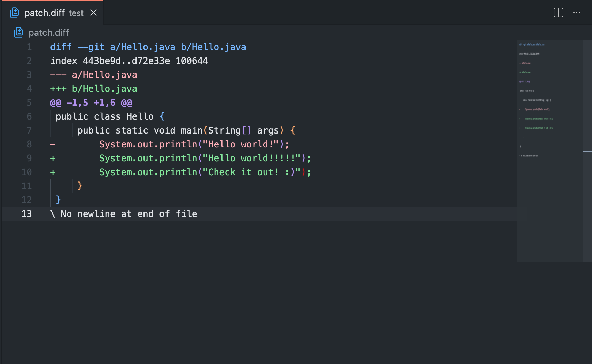
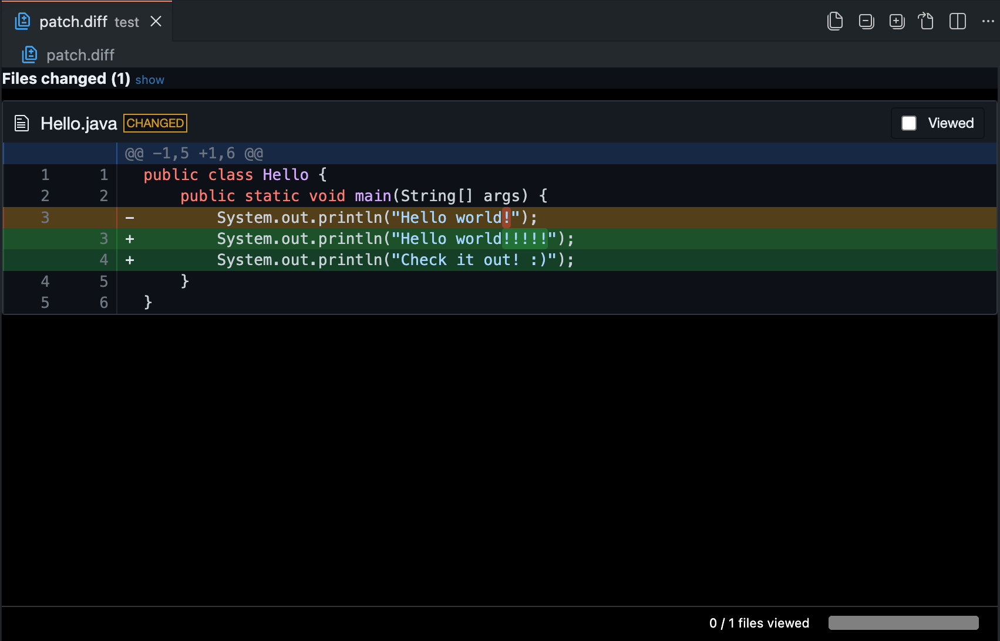

# Diff Viewer extension for VS Code 🔍

Diff Viewer renders `.diff` and `.patch` files inside VS Code with [diff2html](https://github.com/rtfpessoa/diff2html). It gives patch files a readable custom editor, layout switching, and a lightweight review workflow based on collapsing files as you view them.

## Features ✨

- Render `.diff` and `.patch` files in a custom editor instead of raw unified diff text.
- Switch between line-by-line and side-by-side layouts from the editor title bar.
- Collapse reviewed files and track progress across the current diff document.
- Optionally show a persistent footer scrollbar for wide diffs.
- Reopen a diff with all files collapsed from the Explorer context menu.
- Open referenced files directly from file headers and line numbers when those paths are available in the current workspace or by absolute path.

## Demo 🎬

### Without the extension 📄

  

### With the extension ✅

  

## Usage 🚀

1. Open a `.diff` or `.patch` file in VS Code.
2. VS Code will open it with the `Diff Viewer` custom editor.
3. Use the editor title bar buttons to switch between line-by-line and side-by-side views.
4. Use the checkbox beside each file header to collapse it after review, or use the title bar actions to expand or collapse all files.

If you prefer a persistent horizontal scrollbar for wide side-by-side diffs, enable `diffviewer.globalScrollbar`. Viewed state is stored per diff document. If a file's diff changes later, the extension expands it again and marks it as changed since the last view. File header actions are only shown for paths the extension can currently resolve.

## Commands ⌘

- `Show diff line by line`
- `Show diff side by side`
- `Expand all files`
- `Collapse all files`
- `Show raw file`
- `Open diff collapsed (all viewed)` from the Explorer context menu on `.diff` and `.patch` files

## Settings ⚙️

| Setting                                      | Default        | Description                                                |
| -------------------------------------------- | -------------- | ---------------------------------------------------------- |
| `diffviewer.colorScheme`                     | `auto`         | Renderer theme used in the webview.                        |
| `diffviewer.outputFormat`                    | `line-by-line` | Layout used to render the diff.                            |
| `diffviewer.globalScrollbar`                 | `false`        | Show a persistent footer scrollbar for wide diffs.         |
| `diffviewer.drawFileList`                    | `true`         | Show the file summary list above the diff.                 |
| `diffviewer.matching`                        | `none`         | Inline matching mode: `none`, `words`, or `lines`.         |
| `diffviewer.matchWordsThreshold`             | `0.25`         | Similarity threshold used for `words` matching.            |
| `diffviewer.matchingMaxComparisons`          | `2500`         | Upper bound for line matching work inside a changed block. |
| `diffviewer.maxLineSizeInBlockForComparison` | `200`          | Maximum line size considered for block comparisons.        |
| `diffviewer.maxLineLengthHighlight`          | `10000`        | Maximum line size eligible for inline highlight.           |
| `diffviewer.renderNothingWhenEmpty`          | `false`        | Skip rendering files with no visible changes.              |

## Limitations 📌

- The custom editor only activates for files with `.diff` or `.patch` extensions.
- The extension renders patch files; it does not generate diffs itself.
- Opening files from the rendered diff depends on the paths present in the patch and whether those paths are accessible from the current environment.

## Contribute 🤝

Issues and pull requests are welcome. See [CONTRIBUTING.md](CONTRIBUTING.md) for the local setup, supported Node.js version, verification commands, and development workflow.

## License 📄

Released under the MIT License. See [LICENSE](LICENSE).
